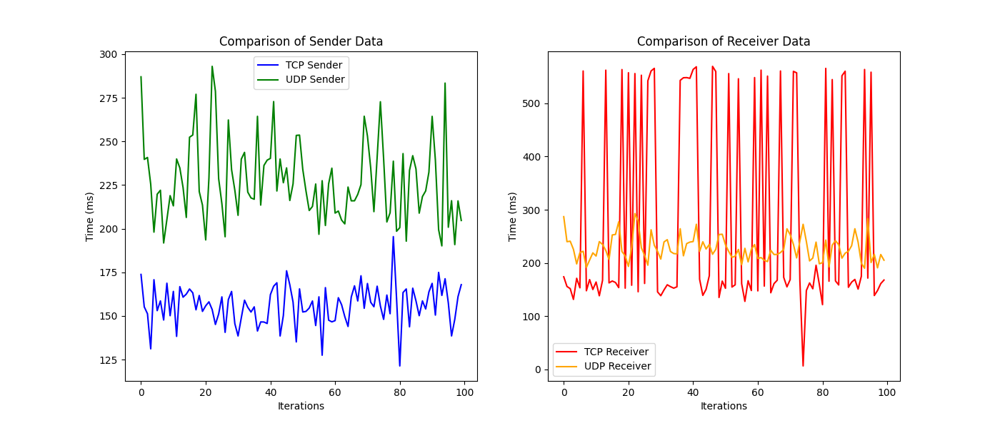

Comparison between `TCP` and `UDP` speeds and packet loss with data visualization too.

# Usage

### Installation

To run everything in a Unix based system open the shell and do:

```bash
# clone the repository
git clone https://github.com/DevTommyy/udp_test.git
cd udp_test

# make the script runnable
chmod +x run.sh

# run everything
./run.sh
```

You'll see something like

```txt
`some cargo things...`
Comparison completed and saved to comparison.txt
```

then you can just open the file with a text editor or cat it:

```bash
less comparison.txt
```

### Sample output

if there is no packet loss:

```txt
The files are identical
```

or, if there is packet loss:

```txt
The files are different
Here are the differences:
1197a1198,1199
> abdicai
> abdicammo
1267a1270,1297
> abiliterai
> abiliteremmo
...

```

### Cleanup

There is a script for the cleanup, if you want to run it, again give it the permission and then run it, it will `cargo clean` both directories

```bash
# make the script runnable
chmod +x cleanup.sh

# run everything
./cleanup.sh

```

# Note

The test only occurs for one protocol out of time (either `TCP` or `UDP`), so to test the other open the project in your editor of choice
e.g.

```bash
# if you have visual studio code cli utility installed
code .
```

then go to `receiver/src/main.rs` and `sender/src/main.rs` and in the `main` function uncomment the wanted protocol and comment the other (it's just commenting and uncommenting a line).
Finally run the run script, then see the results:

```bash
# run everything
./run.sh

# see the output
less comparison.txt
```

# Data

### Data retrieval

To retrive the data to further analize it there is a script `getdata.sh`, it just runs many times the program (so you'll get udp data if in the main there is the udp function uncommented, or viceversa).
To run it just do:

```bash
# make the script runnable
chmod +x getdata.sh

# run everything
./getdata.sh
```

The script also has an additional flag which represents the number of iterations to do, the default is 100, it can be passed when you run the script, like this:

```bash
# make the script runnable
chmod +x getdata.sh

# run everything 20 times
./getdata.sh 20
```

This can be useful if the program fails to run n times, but you want the data so you run it another `n` times.

NOTE: you might see errors output in the script, this is due the small time in between the execution of the program.
_This wont result in any error in the data files_.

All the data will be saved in the `data` directory:

```txt
...
├── data
│   ├── tcp_receiver.txt
│   ├── tcp_sender.txt
│   ├── udp_receiver.txt
│   └── udp_sender.txt
├── getdata.sh
...
```

NOTE: the files in the `data` directory, after the repo clone, have from default the result of the benchmark on my machine.

Also, if you are testing UDP, you can run the script `./getloss.sh` that mostly works as the `getdata.sh` one (but is more sketchy, and freezes frequently) to get the data to plot the packets lost.

```bash
# make the script runnable
chmod +x getloss.sh

# run everything 10 times
./getloss.sh 10
```

### Data analysis

To plot the data obtained, you can simply run

```bash
# note that the python interpreter may vary based on your config
python3 data/visualize_data.py
```

For packets loss we can use:

```bash
# note that the python interpreter may vary based on your config
python3 data/visualize_loss.py
```

This will save the plot as an `.png` image in the `data` directory.
The `requirements` for this are:

- `python` installed
- `pip` installed
- `matplotlib` package installed with pip

## Requirements

Having Rust installed

To install it in a Unix based sysem:

```bash
curl --proto '=https' --tlsv1.2 -sSf https://sh.rustup.rs | sh

```

## Results on my machine

As for the data the result are (I am surprised to see that the UDP Sender takes this much more time):



For the packet loss when using `UDP`:


